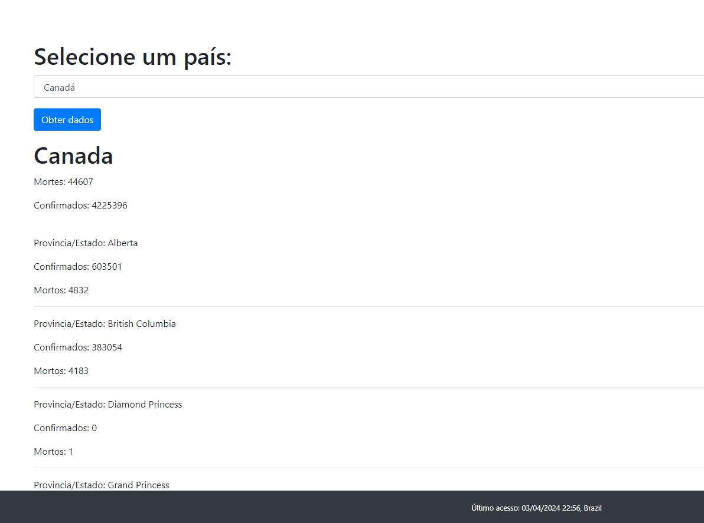

# Projeto PHP KIDOPI

Este é um projeto PHP que utiliza XAMPP como ambiente de desenvolvimento local.

## Requisitos

- PHP
- XAMPP (ou outro servidor local)
- Composer
- Banco de dados (por exemplo, MySQL)

## Rodando o Script do Banco de Dados

1. Certifique-se de que o servidor do banco de dados esteja em execução (por exemplo, MySQL no XAMPP).
2. Execute o script `Dump.sql` (que está na raiz do projeto) em qualquer servidor MySQL.

## Configuração

1. Clone este repositório para o diretório do seu servidor local (por exemplo, `htdocs` para XAMPP).
2. Navegue até o diretório do projeto no terminal.
3. Execute o comando `composer install` para instalar as dependências, incluindo o pacote vlucas/dotenv.
4. Renomeie o arquivo `.env.example` para `.env`.
5. No arquivo `.env`, configure as variáveis de ambiente do banco de dados de acordo com as configurações do seu ambiente local:

   ```dotenv
   URL_DB='mysql:host=localhost;dbname=kidope'
   USER_DB=root
   PASS_DB=''

   ```

   Certifique-se de substituir `USER_DB` e `PASS_DB` pelos valores corretos do seu ambiente.

## Uso

http://localhost/kidopi/ substitua kidopi pelo seu caminho


